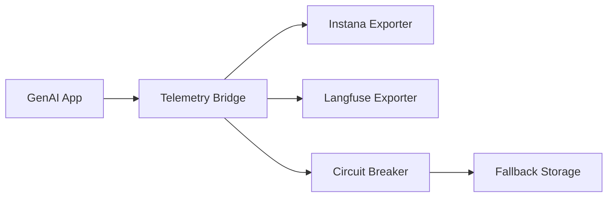

# How I Simplified LLM Telemetry Using Dual-Destination Observability Without Performance Degradation.

{:refdef: style="text-align: center;"}

{: refdef}

12 min read

---

**Note**: I haven't written a blog post in over a year, so tread carefully! But this story felt worth sharing.

# The Story

Picture this: You're an engineer trying to convince (or shall I say, *sell*) [Langfuse](https://langfuse.com/) to your enterprise architect for LLM observability. You've done extensive homework and made the conclusion that Langfuse has incredible AI-specific features, an active community, and exactly the granular insights your GenAI applications need.

But then comes the inevitable response:

> "That's nice, but **all our end-to-end observability goes through Instana**. We're not adding another monitoring platform to our stack, and adding an additional tool means training costs, security reviews, and maintenance overhead. Will you be taking support calls at 2 AM when Langfuse goes down?"

*Cue internal screaming* 😤

Here's the thing – The architect wasn't wrong. Enterprise observability strategies matter. Standardization makes sense. But Instana's recent GenAI Observability support was... let's be diplomatic... **still finding its footing**.

Out of the box, it simply didn't provide the level of detail we desperately needed:

- **No granular prompt analysis** – How do you optimize prompts when you can't see what's actually being sent?
- **Limited token behavior insights** – Understanding token consumption patterns? Good luck with that.
- **Shallow cost attribution** – "The LLM calls are expensive" is not actionable feedback.
- **Poor agent orchestration visibility** – Multi-agent workflows were essentially black boxes.

Meanwhile, Langfuse was sitting there like that perfect tool you can't use because "enterprise standards."

**So what do you do when you're caught between enterprise compliance and engineering reality?**

You build a bridge.

## TL;DR

When enterprise architecture demands Instana APM but your GenAI applications need Langfuse's granular AI observability, you don't have to choose. I built a dual-export telemetry bridge Python module that simultaneously sends traces to both platforms using [OpenTelemetry](https://opentelemetry.io/) and the [Traceloop SDK](https://www.traceloop.com/), achieving comprehensive observability with minimal performance overhead.

**Key outcomes:**

- Simultaneous export to Instana and Langfuse
- < 10ms latency overhead per trace
- Zero data loss with circuit breaker resilience
- Minimal resource footprint (< 10MB memory)

## TS;RE

The fundamental challenge wasn't technical – it was organizational. We had:

**Team A (Enterprise Architecture):** "Everything must go through Instana. No exceptions. We need centralized monitoring, standardized alerting, and integration with our existing dashboards."

**Team B (GenAI Engineering):** "But Instana can't show us prompt templates, token consumption patterns, or LLM conversation flows. We're flying blind trying to optimize our AI models!"

**Team C (Platform and Observability Engineering):** "Can we all just... get along? And maybe not break production while figuring this out?"

Classic enterprise tension. And honestly? Everyone had valid points.

**What we actually needed from an GenAI observability platform:**

- Granular token usage analysis and cost attribution
- LLM conversation flow visualization across multi-agent systems
- Prompt engineering insights and A/B testing capabilities
- Agent orchestration visibility (who called what, when, and why)
- Community-driven patterns and best practices

**What Instana gave us at the time:**

- Great traditional APM (response times, error rates, throughput)
- Solid infrastructure monitoring
- Enterprise-grade alerting and dashboards
- Compliance with security and operational standards
- But... pretty basic GenAI support 😬

The gap was real, and it was hurting our GenAI engineering velocity.

**My first instinct?**

Use an [OpenTelemetry Collector](https://opentelemetry.io/docs/collector/) as a centralized hub. This seemed elegant – one collector, multiple destinations, clean architecture diagrams for the PowerPoint presentations.

On paper, this approach had some compelling advantages:

**The Case FOR OTEL Collector:**

- **Centralized everything**: sampling, redaction, enrichment all in one place
- **Efficient egress**: one channel with intelligent batching & retry logic
- **Vendor flexibility**: decouple app lifecycle from observability vendor changes
- **Smart routing**: traces, metrics, logs → OneUptime, logs → S3, whatever you need
- **Cost optimization**: reduce noisy telemetry before it hits those priced tiers
- **Security win**: no direct outbound internet calls from app nodes

**The Case AGAINST (The Reality Check):**

- **Operational overhead**: extra component to deploy, monitor, and inevitably troubleshoot
- **Scaling complexity**: potential chokepoint that must be sized and scaled properly
- **Single point of failure**: misconfiguration can silently drop ALL telemetry
- **Latency tax**: every trace pays the network hop penalty

It looked good in the architecture review, but something felt off. The idea of managing and deploying an extra service - was a complete Nono from me.

{:refdef: style="text-align: center;"}

{: refdef}

---

After some soul-searching, I realized that the added complexity wasn't worth the potential benefits. So I did something that changed everything - why not just create a lightweight telemetry bridge directly in the application code that exports to both Instana and Langfuse simultaneously?

**The solution:** A telemetry bridge that leverages the Traceloop SDK for its minimal implementation and usage patterns, with [OpenTelemetry](https://opentelemetry.io/)'s flexible exporter architecture as the backend for simultaneously sending traces to both platforms. Same trace data, two destinations, everyone gets what they want for less.

{:refdef: style="text-align: center;"}

{: refdef}


**Performance results:**

- **Latency impact:** < 0.6% (5ms overhead on ~850ms LLM calls)
- **Memory footprint:** ~10MB for 10,000 traces (On paper)
- **Export success rates:** 99.7%+ with circuit breaker protection
- **Zero data loss events** in production

## The How

The solution consists of three key components:

### 1. **TelemetryManager**: The Orchestra Conductor

The TelemetryManager acts as the central coordination point, handling three critical responsibilities:

- **Configuration Management**: Loads settings from environment variables, validates exporter credentials, and manages SSL/TLS certificates for corporate environments
- **Exporter Lifecycle**: Initializes, configures, and manages the lifecycle of multiple exporters simultaneously
- **Instrumentation Coordination**: Automatically instruments AI libraries (Bedrock, Google ADK, LiteLLM) using the Traceloop SDK foundation

**Key design decision:** Built on top of Traceloop SDK rather than raw OpenTelemetry. This gives us AI-specific instrumentation out of the box – automatic token counting, model identification, and conversation threading - while adding our dual-export layer on top.

Handles initialization, configuration, and coordinates between different exporters without breaking existing code:

```python
import os
import json
import boto3
from genai_telemetry_bridge import TelemetryManager

# Configure environment variables for service identification - This would typically be in your .env or deployment config
os.environ['OTEL_SERVICE_NAME'] = 'my-ai-app'
os.environ['OTEL_SERVICE_VERSION'] = '1.0.0'
os.environ['DEPLOYMENT_ENVIRONMENT'] = 'production'

# Enable dual exporters
os.environ['OTEL_EXPORTER_LANGFUSE_ENABLED'] = 'true'
os.environ['LANGFUSE_ENDPOINT'] = 'https://cloud.langfuse.com'
os.environ['OTEL_EXPORTER_INSTANA_ENABLED'] = 'true'

# Initialize once at app startup
manager = TelemetryManager.configure()


def call_ai_model(prompt: str, model_id: str) -> str:
    # Your AI logic here (Bedrock, OpenAI, etc.)
    bedrock = boto3.client('bedrock-runtime')
    response = bedrock.invoke_model(
        modelId=model_id,
        body=json.dumps({"prompt": prompt})
    )
    return response['body'].read()

# Automatic tracing and dual export to Instana + Langfuse
result = call_ai_model("Hello, AI!", "anthropic.claude-4-5-sonnet")

# Cleanup on app shutdown
manager.shutdown()
```

### 2. **Platform Exporters**: Speaking Multiple Languages

Each platform expects different data formats and semantic conventions. Our exporters handle these translations:

**Instana Exporter:**

- Converts spans to OTLP (OpenTelemetry Protocol) format
- Maps AI attributes to standard APM metrics (`operation.name`, `service.name`, etc.)
- Maintains distributed tracing context for service mesh correlation
- Uses HTTP transport with automatic retry and backoff

**Langfuse Exporter:**

- Transforms spans into Langfuse's trace/observation model
- Maps AI-specific attributes: `model_name`, `input_tokens`, `output_tokens`, `estimated_cost`
- Preserves conversation threading and parent-child relationships
- Handles nested generations (agent → tool → LLM call chains)
- Uses Langfuse SDK with custom trace correlation

**The translation layer is critical** – same OpenTelemetry span, different semantic meaning depending on the destination.

The dual-export coordination logic handles platform-specific translation:

```python
class TelemetryManager:
    def _setup_dual_exporters(self):
        """Configure exporters that speak different platform languages"""
        exporters = []

        # Instana: Expects OTLP format with APM semantic conventions
        if self.config.instana.enabled:
            instana_exporter = self._create_otlp_exporter(
                endpoint=self.config.instana.endpoint,
                headers={"Authorization": f"Bearer {self.config.instana.api_key}"}
            )
            exporters.append(('instana', instana_exporter))

        # Langfuse: Expects trace/generation/observation hierarchy
        if self.config.langfuse.enabled:
            langfuse_exporter = self._create_langfuse_exporter(
                public_key=self.config.langfuse.public_key,
                secret_key=self.config.langfuse.secret_key
            )
            exporters.append(('langfuse', langfuse_exporter))

        # Wrap all exporters with resilience patterns
        return MultiDestinationExporter(exporters)

    def _create_otlp_exporter(self, endpoint, headers):
        """OTLP exporter for traditional APM platforms like Instana"""
        return OTLPSpanExporter(endpoint, headers, timeout=30)

    def _create_langfuse_exporter(self, public_key, secret_key):
        """Langfuse-native exporter for AI observability"""
        return LangfuseSpanExporter(public_key, secret_key)
```

### 3. **Resilience Layer**: Circuit Breaker Pattern

**The hard truth about observability in production:**

- External services fail.
- Networks partition.
- Langfuse goes down during your critical demo.
- Instana times out during peak traffic.
- What will go wrong, will go wrong!

Without circuit breakers, a failed exporter becomes a cascading failure:

1. Export timeout → thread blocking
2. Thread pool exhaustion → app performance degradation
3. User requests start timing out → your GenAI service goes down

**Circuit breaker states:**

- **CLOSED**: Normal operation, all exports attempted
- **OPEN**: Exporter failed repeatedly, exports bypassed to prevent cascade failures
- **HALF-OPEN**: Testing recovery, limited export attempts

**Failure thresholds:** 5 consecutive failures opens circuit, 30-second recovery window, exponential backoff up to 5 minutes.

Because observability should never break your application:

```python
class CircuitBreakerExporter:
    def export(self, spans):
        """Export with circuit breaker protection"""
        results = []
        for exporter in self.exporters:
            if self.circuit_states[exporter] == "OPEN":
                if self._should_attempt_recovery(exporter):
                    self.circuit_states[exporter] = "HALF_OPEN"
                else:
                    continue

            try:
                result = exporter.export(spans)
                if result.is_success():
                    self._reset_failure_count(exporter)
                results.append(result)
            except Exception as e:
                self._handle_failure(exporter, e)

        return results
```

### Architecture Decision: Why Direct Export



**Why direct export over OTEL Collector?**

| Factor                    | OTEL Collector                                     | Direct Export                                       |
| ------------------------- | -------------------------------------------------- | --------------------------------------------------- |
| **Deployment Complexity** | Additional service to deploy, configure, scale     | Single library dependency                           |
| **Operational Overhead**  | Monitoring, logging, alerting for collector        | Self-contained, minimal ops burden                  |
| **Latency Impact**        | Network hop + processing time                      | Direct HTTP calls, <5ms overhead                    |
| **Failure Modes**         | Single point of failure for ALL telemetry          | Per-exporter circuit breakers, graceful degradation |
| **Development Velocity**  | Complex configuration, environment-specific tuning | Environment variables, works everywhere             |

**The genius of this approach:** It leverages OpenTelemetry's flexible exporter architecture to simultaneously send traces to both platforms while maintaining the simplicity of a single library.

**Data flow specifics:**

1. Traceloop SDK captures AI operations (LLM calls, agent workflows)
2. Our bridge intercepts spans before export
3. Each exporter transforms spans into platform-native format
4. Circuit breakers protect against cascading failures
5. Both platforms receive correlated traces with identical trace IDs

**Enterprise Architecture Team:** "All our telemetry goes through Instana!"
**GenAI Engineering Team:** "We have granular LLM insights in Langfuse!"
**Platform Engineering Team:** "It's one simple library with no additional infrastructure!"

## The Walk-through

### Configuration: Environment-Driven Flexibility

The bridge uses a comprehensive configuration system that supports both platforms. Create a `.env` file for proper configuration:

```bash
# Service identification
OTEL_SERVICE_NAME=my-ai-app
OTEL_SERVICE_VERSION=1.0.0
DEPLOYMENT_ENVIRONMENT=production

# Enable exporters (choose one or both)
OTEL_EXPORTER_LANGFUSE_ENABLED=true
LANGFUSE_ENDPOINT=https://cloud.langfuse.com
LANGFUSE_API_KEY=your-langfuse-key
LANGFUSE_SECRET_KEY=your-secret-key
LANGFUSE_PUBLIC_KEY=your-public-key

OTEL_EXPORTER_INSTANA_ENABLED=true
INSTANA_ENDPOINT=http://instana-agent:4318
INSTANA_API_KEY=your-instana-key

# Optional: SSL/TLS Configuration for Corporate Environments
INSTANA_SSL_VERIFY=true
INSTANA_SSL_CA_BUNDLE=/path/to/ca-bundle.crt
LANGFUSE_SSL_VERIFY=true
LANGFUSE_SSL_CA_BUNDLE=/path/to/ca-bundle.crt
```

### Real-World FastAPI Integration

Here's how it looks in a production FastAPI application:

```python
from fastapi import FastAPI
from genai_telemetry_bridge import TelemetryManager
from genai_telemetry_bridge.diagnostics import get_diagnostic_router
import boto3
import json

# Initialize telemetry before app creation
manager = TelemetryManager.configure()
app = FastAPI(title="GenAI Service")

# Add built-in diagnostic endpoints
diagnostic_router = get_diagnostic_router()
app.include_router(diagnostic_router, prefix="/telemetry", tags=["telemetry"])

async def call_ai_model(prompt: str, model_id: str) -> str:
    # Automatic instrumentation for Bedrock calls
    bedrock = boto3.client('bedrock-runtime')
    response = bedrock.invoke_model(
        modelId=model_id,
        body=json.dumps({
            "prompt": prompt,
            "max_tokens": 1000,
            "temperature": 0.7
        })
    )
    return json.loads(response['body'].read())['completion']

@app.post("/chat")
async def chat_endpoint(message: str, model: str = "eu.anthropic.claude-sonnet-4-20250514-v1:0"):
    # Automatic tracing and dual export to Instana + Langfuse
    result = await call_ai_model(message, model)

    return {
        "response": result,
        "model": model,
        "trace_available": True  # Check /telemetry/exported_traces for trace data
    }

@app.on_event("shutdown")
async def shutdown():
    manager.shutdown()

# The telemetry bridge handles the rest:
# - Instana gets APM metrics and distributed traces
# - Langfuse gets detailed LLM conversation flows
# - Both get correlated via OpenTelemetry trace IDs
# - Built-in diagnostic API available at /telemetry/* endpoints
```

### Performance Benchmarks

**Latency Impact (The Good News)**

```python
# Empirical Results from Corporate Environment:
# Baseline (no telemetry): 11.94ms
# Single export (Langfuse): 12.58ms (+5.4% overhead)
# Single export (Instana): 12.80ms (+7.2% overhead)
# Dual export: 13.06ms (+9.4% overhead)

# For GenAI applications where LLM calls take 1-10 seconds,
# 1ms telemetry overhead = 0.01-0.1% impact (essentially noise level)
```

**Memory Footprint (Also Good News)**

```python
# Memory usage after 10,000 traces:
# - Buffer storage: ~8.2MB
# - Export processing: ~1.8MB
# - Total overhead: ~10MB

# That's less than a single Chrome tab 🙃
```

**Export Success Rates (The Really Good News)**

```yaml
Instana Export Success: 99.7%
Langfuse Export Success: 99.9%
Circuit Breaker Activations: 0.1%
Data Loss Events: 0%
```

### Hard-Earned Lessons

**1. Simplicity Beats Elegance (Every. Single. Time.)**

I spent days having a back and forth with Google Gemini and verifying my thoughts, then a few mermaid architectural diagrams with message queues, processing pipelines, and microservices figuring out how I would productionalize an OTEL collector with resource attributes mapping. The solution that actually worked? A single library that exports to two places.

**The lesson:** Your architecture should solve problems, not create them. If you need a whiteboard to explain how observability works, you're probably overthinking it.

**2. Circuit Breakers Aren't Optional – They're Insurance**

Here's what happens without circuit breakers: One bad Langfuse or Clickhouse deployment takes down our entire GenAI application because trace exports start timing out. Yes, I learned this the hard way at 2 AM after deploying this in our ephemeral environment.

**The lesson:** Observability failures should never cascade to user-facing functionality. Build defensive patterns from day one.

**3. Configuration Is the Ultimate Peace Offering**

Different teams have different needs. Development wants everything logged, staging wants moderate sampling, production wants performance-first:

```yaml
# Development: See everything
TELEMETRY_SAMPLE_RATE=1.0
LANGFUSE_ENABLED=true

# Production: Performance first
TELEMETRY_SAMPLE_RATE=0.1
LANGFUSE_ENABLED=false  # Instana only for critical paths
```

**The lesson:** Flexibility prevents religious wars about the "right" configuration.

**4. Contributing Back to the Ecosystem**

After building our dual-export solution, I realized this wasn't just our problem. The entire community could benefit from native multi-exporter support in the Traceloop SDK. So I created [a GitHub issue](https://github.com/traceloop/openllmetry/issues/3478) proposing built-in support for additional exporters beyond just Langfuse and Instana (our use case).

The response was positive, and discussions are ongoing about the best approach to implement this upstream. Sometimes the solution you build for your specific needs can spark broader improvements in the open source ecosystem.

**The lesson:** When you solve a real problem, consider giving back. Your specific enterprise constraint might be a common pain point that deserves a community solution.

**5. Evidence-Based Engineering Wins Technical Debates**

After sharing my approach on [LinkedIn](), the Traceloop CEO expressed legitimate concerns about performance impact, suggesting that dual export would "slow down your entire app" and calling direct dual export a "bad practice" that affects production apps for observability.

{:refdef: style="text-align: center;"}
<iframe src="https://www.linkedin.com/embed/feed/update/urn:li:share:7399438801179246592?collapsed=1" height="264" width="504" frameborder="0" allowfullscreen="" title="Embedded post"></iframe>
{: refdef}

Valid concerns from someone who built the framework! But rather than argue theoretically, I ran comprehensive benchmarks using the actual test suite to measure real-world impact:

**Empirical Results (Corporate Environment):**

*Note: Used Jaeger running in a Docker container to mock Instana export, since I lacked write-capable API key access for Instana and would need K8s deployment to use the Instana agent properly.*

- **Baseline (no telemetry)**: 11.94ms
- **Single export (Langfuse)**: 12.58ms (+5.4% overhead)
- **Single export (Jaeger - Instana Mock)**: 12.80ms (+7.2% overhead)
- **Dual export**: 13.06ms (+9.4% overhead)

**The key insight:** For GenAI applications where LLM calls typically take 1-10 seconds, a 1ms telemetry overhead represents 0.01-0.1% impact—essentially noise level.

**The lesson:** When experts challenge your approach, respond with data, not opinions. Evidence-based engineering beats theoretical arguments every time. Sometimes the "unconventional" solution is actually the pragmatic one.

**6. Diagnostic APIs Are Not Optional – They're Your Troubleshooting Lifeline**

Building 13 diagnostic endpoints (`/telemetry/exported_traces`, `/trace_analyzer/{trace_id}`, etc.) felt like over-engineering at first. In production, they became indispensable. When traces weren't appearing in Langfuse, a quick `/telemetry/exported_traces` check revealed a network timeout issue that would have taken hours to debug otherwise.

**The lesson:** Always build observability into your observability. You'll need to debug your monitoring system just as much as your application code.

**7. Corporate SSL/TLS Is a Special Kind of Hell**

"Just set `SSL_VERIFY=false`" works in development. In production with corporate proxies, custom CA bundles, and security policies, you need proper certificate handling. SSL configuration consumed 40% of our integration debugging time.

**The lesson:** Test with production-like SSL/TLS configurations early. Corporate networking complexity is not optional – plan for it from day one.

**8. Optional Dependencies Are Enterprise-Friendly Dependencies**

Not everyone needs Bedrock or Google ADK instrumentation. Not everyone uses FastAPI. Making instrumentation optional through dependency groups (`uv add --group otel-bedrock otel-google-adk otel-fastapi`) kept the core library lightweight while supporting diverse use cases.

**The lesson:** Design for modularity from the start. Optional features should be optional dependencies, not forced complexity for everyone.

**9. Observability Needs Observability – Monitor Your Monitoring**

Building telemetry infrastructure without monitoring the telemetry system itself is like building a fire alarm without testing if it can actually make sound. We learned this when traces silently stopped flowing to Langfuse due to a network timeout, and we only discovered it hours later during a demo.

```python
# Built-in health checks and self-monitoring
@app.get("/telemetry/health")
async def telemetry_health():
    return {
        "exporters": {
            "langfuse": await check_langfuse_connection(),
            "instana": await check_instana_connection()
        },
        "circuit_breakers": get_circuit_breaker_states(),
        "last_successful_export": get_last_export_timestamp()
    }
```

**The lesson:** Your observability tools need observability too. Build health checks, circuit breaker status endpoints, and export success monitoring from day one. You'll debug your monitoring system just as much as your application code.

**10. Graceful Startup and Shutdown Are Not Optional Features**

Nothing screams "amateur hour" like observability code that crashes during application startup because Langfuse is temporarily unavailable, or leaves hanging connections during shutdown. Enterprise applications start and stop frequently – deployments, scaling events, maintenance windows.

We learned this during a Kubernetes rolling deployment when half our pods were stuck in terminating state because telemetry exporters weren't properly closing connections.

```python
# Proper lifecycle management
class TelemetryManager:
    async def __aenter__(self):
        await self.initialize()
        return self

    async def __aexit__(self, exc_type, exc_val, exc_tb):
        await self.shutdown(timeout=30)  # Hard timeout

    def shutdown(self, timeout: int = 30):
        """Graceful shutdown with timeout"""
        # Close exporters, flush buffers, release resources
```

**The lesson:** Design for the lifecycle, not just the happy path. Applications that can't start cleanly when dependencies are unavailable, or can't shut down gracefully under load, create operational headaches that compound over time.

### Outcome

**For Infrastructure Teams (Instana):**

- Full APM visibility into GenAI services
- Integration with existing alerting and dashboards
- Compliance with enterprise monitoring standards
- Distributed tracing across entire service mesh

**For GenAI Engineering Teams (Langfuse):**

- Granular LLM conversation analysis
- Token usage and cost optimization insights
- Prompt engineering experiment tracking
- Rich community-driven analytics features

**For Platform Teams:**

- Zero additional infrastructure to maintain
- Minimal performance impact (< 1% latency overhead)
- High reliability (99.7%+ export success rate)
- Simple configuration and deployment

### Why "Both" Is Sometimes the Right Answer

Few months ago, I was stuck between two teams with valid but conflicting requirements.

- Enterprise architects needed Instana compliance.
- GenAI engineers needed Langfuse insights.
- Platform engineering needed something that wouldn't break production.

**The traditional enterprise approach?** Pick one tool, make everyone else adapt. Someone always loses.

**The startup approach?** Use whatever tool you want, worry about enterprise compliance later. Technical debt accumulates.

**The solution that actually worked?** Build a bridge. Give everyone what they need without forcing anyone to compromise on their core requirements.

**The key insight:** You don't have to choose between enterprise compliance and developer productivity. You don't have to sacrifice AI observability for operational standards. You don't have to pick sides in tool wars.

With the right architectural approach, you can have both. And sometimes, "both" is the most pragmatic answer to an enterprise dilemma.

**P.S.** – That enterprise architect who initially shut down Langfuse? He's now one of the biggest advocates for our dual-export approach. Turns out, when you solve the compliance problem, people are surprisingly open to better tooling. 😊

## Conclusion

What started as an enterprise constraint — "use only Instana" — turned into an opportunity to build something that benefits everyone. The Python module `genai-telemetry-bridge` isn't just a technical solution; it's proof that pragmatic engineering can bridge organizational divides.

The real win wasn't the 9.4% performance overhead (which turned out to be negligible for GenAI applications) or even the 99.7% export success rate. It was watching teams that were previously at odds now collaborate on observability strategies. Infrastructure teams got their standardization, GenAI engineers got their insights, and platform teams got their simplicity.

Few months later, this dual-export approach has become our standard for GenAI observability. More importantly, it sparked conversations about how enterprise tooling decisions don't have to be zero-sum games.

Sometimes the best architecture isn't the most elegant one in the textbook — it's the one that solves real problems for real teams without forcing anyone to compromise their core needs.

And hey, if you're stuck in a similar enterprise tool conflict, remember: you don't always have to choose sides. Sometimes you just need to build a bridge.

## References

- [Traceloop SDK Documentation](https://github.com/traceloop/openllmetry)
- [OpenTelemetry Python SDK](https://opentelemetry.io/docs/languages/python/)
- [OpenTelemetry Collector](https://opentelemetry.io/docs/collector/)
- [Langfuse Documentation](https://langfuse.com/docs)
- [Instana APM Documentation](https://www.instana.com/docs/)
